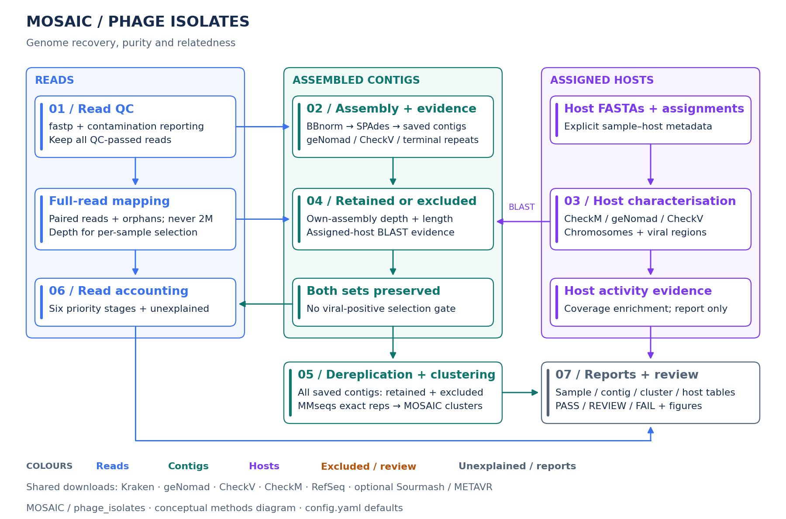
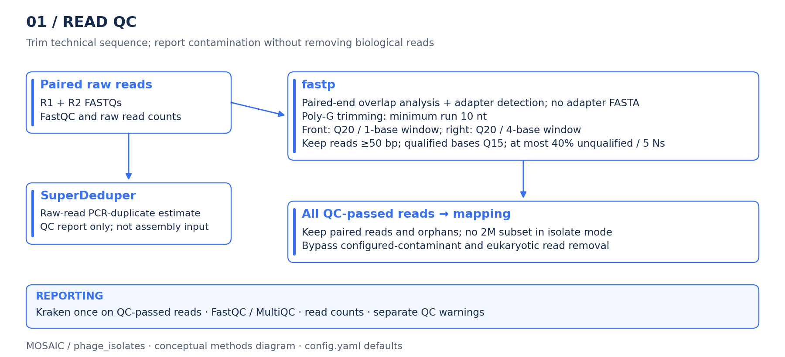
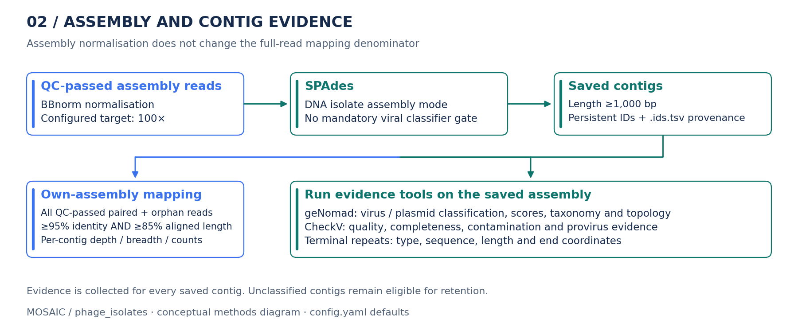
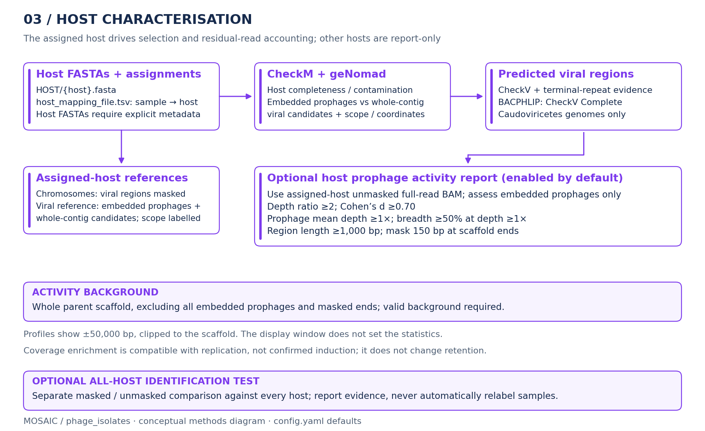
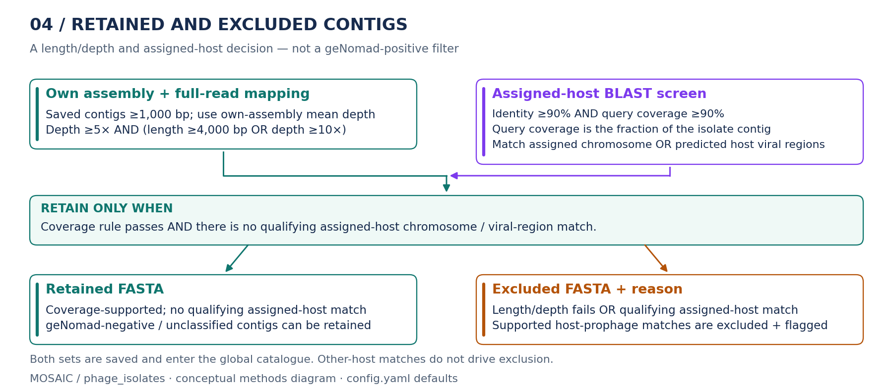
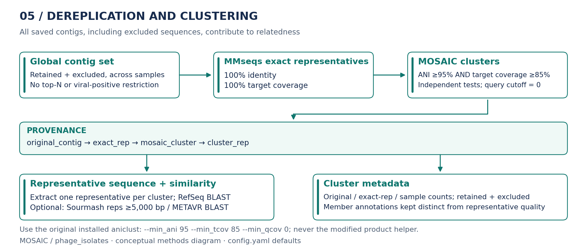
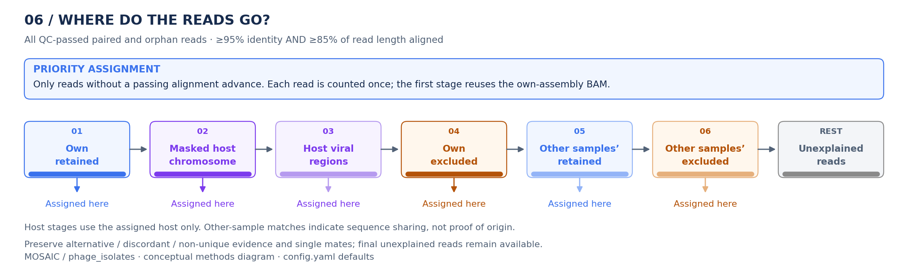
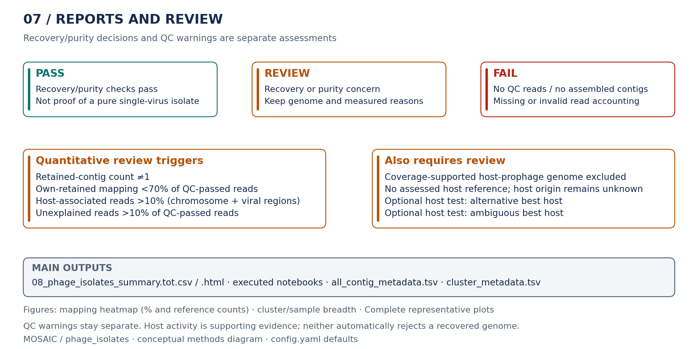

# Phage isolate recovery and purity

The isolate workflow assesses genome recovery, purity and relatedness across a collection of sequenced phage isolates. The expected result is one dominant viral genome per sample, but fragmentation, host DNA and possible mixtures remain visible for review. A warning does not automatically invalidate a recovered genome.

Unlike the virome workflow, it does not require a geNomad viral-positive call. All saved SPAdes contigs enter the catalogue; retained/excluded is a coverage-and-assigned-host decision. Novel or unclassified sequences are not removed simply because a viral classifier did not recognise them.

## Quick start

Run from `mosaic/`:

```bash
snakemake --use-conda -p phage_isolates \
  --config \
    input_dir=/path/to/project/00_RAW_DATA \
    isolates=True metagenome=False \
    sourmash_clean_reads=True sourmash_contig_catalogue=True \
  -j 128 -k --rerun-incomplete -n
```

Remove `-n` to execute. This example enables both optional Sourmash screens, with the default 5,000 bp cutoff for cluster representatives. Omit those two flags for the core isolate analysis. `isolates=True` enforces DNA assembly mode and bypasses biological read removal, regardless of the virome defaults for `metagenome`, `RNA_enriched` or `remove_euk`.

Add `map_to_RefSeq=True` for independent RefSeq read mapping/detection, `metavr_blast=True` for METAVR similarity searches, or `host_identification_test=True` for the all-host comparison. These are not prerequisites for the core recovery/purity assessment. RefSeq BLAST of cluster representatives is already part of the core report; it is separate from the optional read-mapping branch.

## Inputs and project layout

```text
project/
├── 00_RAW_DATA/
│   ├── IsolateA_R1.fastq.gz
│   ├── IsolateA_R2.fastq.gz
│   ├── IsolateB_R1.fastq.gz
│   └── IsolateB_R2.fastq.gz
├── HOST/
│   ├── HostA.fasta
│   └── HostB.fasta
└── host_mapping_file.tsv
```

`host_mapping_file.tsv` is tab-separated:

```tsv
sample	host
IsolateA	HostA
IsolateB	HostB
```

| Input | Requirement |
| --- | --- |
| Paired Illumina FASTQs | Required. Default names are `{sample}_R1.fastq.gz` and `{sample}_R2.fastq.gz`; change `forward_tag`/`reverse_tag` if needed. Sample IDs are discovered from the reverse-read filenames. |
| `HOST/{host}.fasta` | Supply the available bacterial host assemblies directly under `HOST/`. The host ID is the filename without `.fasta`. |
| `host_mapping_file.tsv` | Required whenever host FASTAs exist. Every analysed sample needs one assignment to an available host. Several samples can use the same host. The file can instead be under `HOST/`; if both copies exist they must agree. |
| `config.yaml` and Conda | Use the repository configuration and `--use-conda`. The command-line options override the YAML defaults. |
| Databases and external tools | Missing default databases/tools are provided by their existing download rules. First execution needs network access and sufficient disk space; existing installations are reused. Custom database paths must refer to usable installations or outputs supported by a download rule. |

By default, results are written beside `00_RAW_DATA`, in its parent project directory. `results_dir=/path/to/project` can override that location; place `HOST/` and the host assignment table under the selected results directory. Runs without host FASTAs are allowed, but host origin is explicitly unassessed and the isolate decision requires review. There is no inferred host assignment from a sample name.

### Databases and tools

Existing download rules provide these shared dependencies when needed. Sourmash downloads are only required when either optional Sourmash screen is enabled.

| Download rule | Used for |
| --- | --- |
| `downloadKrakenDB`, `getKrakenTools` | Read-level contamination reporting. |
| `downloadGenomadDB` | Assembly and host classification evidence. |
| `downloadCheckvDB` | Isolate-contig and host viral-region quality assessment. |
| `downloadCheckMDB` | Host assembly completeness/contamination. |
| `downloadRefSeqViral` | Core cluster-representative BLAST; also reused by optional RefSeq read mapping. The downloader keeps a dated snapshot and undated links. |
| `downloadSourmashRocksDB`, `downloadSourmashTaxonomy` | GTDB RS226 references and matching taxonomy, shared by both optional Sourmash screens. |

## Workflow overview



[Zoomable overview (SVG)](figures/phage_isolates_overview.svg)

The diagrams show the biological steps, not individual Snakemake jobs. Blue is reads, teal is contigs, purple is hosts, amber is exclusions/review, and grey is unexplained reads/reports. Each major step has its own diagram below. Thresholds shown are the repository defaults; a run with config overrides can use different values. The saved SPAdes filter is **1,000 bp (1 kb)**, not 1,000 kb.

| Step | What happens |
| --- | --- |
| [1. Read QC](#1-read-qc) | fastp trims adapters/poly-G and low-quality sequence. FastQC/MultiQC, read counts, SuperDeduper statistics and Kraken provide QC/contamination evidence. Biological read removal is bypassed. |
| [2. Assembly and contig evidence](#2-assembly-and-contig-evidence) | BBnorm-normalised QC-passed reads enter SPAdes. Save contigs >=1 kb, assign persistent IDs, then collect geNomad, CheckV and terminal-repeat evidence. Assembly reads are not the purity-mapping denominator. |
| [3. Host characterisation](#3-host-characterisation) | CheckM, geNomad, CheckV and eligible BACPHLIP predictions describe assigned hosts and viral regions. Optional activity testing measures coverage enrichment. |
| [4. Retained and excluded contigs](#4-retained-and-excluded-contigs) | Full-read own-assembly mapping supplies depth. Apply the configured length/depth rule and assigned-host chromosome/viral-region BLAST screen; preserve both FASTAs. |
| [5. Dereplication and clustering](#5-dereplication-and-clustering) | Concatenate all saved contigs, exactly dereplicate with MMseqs, then cluster at independent >=95% ANI and >=85% target coverage. Extract representatives and search RefSeq; optional Sourmash/METAVR screens add evidence. |
| [6. Priority read accounting](#6-priority-read-accounting) | Assign each QC-passed read once through six stages. Preserve alternative/single-mate evidence and the final unexplained reads. |
| [7. Reports and review](#7-reports-and-review) | Sample decisions, contig/cluster metadata, host summaries and figures. Optional full-read Sourmash, RefSeq mapping and host identification remain separate comparisons. |

To regenerate the compact diagrams from the repository root:

```bash
conda activate Mosaic_workflow
python mosaic/docs/generate_isolate_diagrams.py
```

This documentation-only generator uses matplotlib and PyYAML from the workflow environment. It reads `config.yaml` for configurable thresholds and saves PNG plus editable-text SVG files under `mosaic/docs/figures/`. It does not call Snakemake, execute analysis, download databases or change project results. Layouts and shared alignment/clustering policies are explicit in the generator, so update those labels if the workflow policy changes.

See [clean-read Sourmash](sourmash_clean_reads.md), [cluster-representative Sourmash](sourmash_contig_catalogue.md), [contig identifiers](contig_identifiers.md) and [optional RefSeq mapping](refseq_mapping.md) for the branch-specific details.

## 1. Read QC



[Zoomable read-QC diagram (SVG)](figures/phage_isolates_01_read_qc.svg)

With `isolates=True`, biological read removal is bypassed, including configured-contaminant and eukaryotic removal. Kraken classifies the QC-passed reads once for reporting; no post-decontamination Kraken job is required. All fastp-passed paired reads and orphans enter mapping, never the 2M subset. BBnorm normalisation is for assembly, not purity mapping. SuperDeduper measures PCR duplicates on the raw pairs for QC reporting; the current assembly path does not consume its deduplicated output, and neither fastp deduplication nor a separate PCR-duplicate filter is enabled.

## 2. Assembly and contig evidence



[Zoomable assembly diagram (SVG)](figures/phage_isolates_02_assembly_evidence.svg)

Existing saved SPAdes assemblies retain their filenames and >=1 kb filtering. Persistent renamed IDs identify contigs throughout the analysis; neighbouring `.ids.tsv` sidecars preserve old assembler names for provenance only. geNomad, CheckV and terminal-repeat checks run on the saved assembly. Their results are evidence, not mandatory viral selection gates. Six biological categories are not imposed. RNA assembly, virome-positive filtering, VIBRANT, VirSorter, Pharokka, Phynteny and legacy AAI analysis are not required by the isolate target.

## 3. Host characterisation



[Zoomable host diagram (SVG)](figures/phage_isolates_03_hosts.svg)

Host FASTAs require explicit sample-to-host assignments. CheckM describes host assembly quality; geNomad supplies predicted embedded prophages and whole-contig viral candidates, kept as separate evidence scopes. CheckV and terminal-repeat evidence describe those viral regions. BACPHLIP is limited to CheckV-complete Caudoviricetes genomes.

The assigned host supplies the masked chromosome and viral-region references used below. The optional all-host comparison is report-only. [Host activity testing](#host-prophage-activity) uses the assigned unmasked host mapping, compares each embedded prophage with its whole parent-scaffold background, and does not change retention. It is enabled by default for isolate runs with hosts.

## 4. Retained and excluded contigs



[Zoomable selection diagram (SVG)](figures/phage_isolates_04_selection.svg)

Full-read own-assembly mapping supplies contig depth. Retention requires:

```text
depth >= isolate_min_depth
AND (length >= isolate_min_length_bp OR depth >= isolate_short_min_depth)
AND no qualifying host chromosome/host viral-region match
```

Defaults are 5x, 4,000 bp and 10x. Host BLAST requires >=90% identity AND >=90% query coverage, controlled by `isolate_host_min_identity` and `isolate_host_min_query_coverage`. Only matches to the sample's assigned host chromosome or its predicted viral regions drive exclusion. Supported host-prophage-associated genomes are excluded from the retained set but preserved and flagged. Other-host matches remain available in metadata and the all-host BLAST table/heatmap; they never automatically exclude or relabel a contig.

Isolate host and RefSeq/METAVR BLAST outputs append `sstart send bitscore btop` to the existing eleven columns. Query/reference breadth uses merged inclusive coordinate intervals, without double-counting overlapping alignments. Host identity is calculated from the same selected query portions, using the highest-scoring alignment where HSPs overlap and counting mismatches/gaps from BTOP. Each query/reference pair is assessed separately. Historical eleven-column files remain readable with identity explicitly labelled `legacy HSP identity estimate` and unavailable reference breadth left missing; regenerate BLAST for exact traceback-based identity. Other annotation datasets retain their existing BLAST output format.

## 5. Dereplication and clustering



[Zoomable clustering diagram (SVG)](figures/phage_isolates_05_clustering.svg)

All saved contigs retain the hierarchy `original_contig -> exact_rep -> mosaic_cluster -> cluster_rep`. Existing concatenation, exact MMseqs dereplication, provenance, per-assembly geNomad/CheckV and CheckV ANI calculation are reused, including DNA-only sharing links. Both retained and excluded sequences enter this global catalogue, without a top-N restriction. MMseqs uses 100% identity and 100% target coverage.

Every clustering command uses the original installed CheckV tool:

```bash
aniclust --fna ... --ani ... --out ... \
  --min_ani 95 --min_tcov 85 --min_qcov 0
```

ANI and target coverage pass independently. The local modified product-based `scripts/aniclust_checkv.py` is not invoked or edited. Optional Sourmash screens representatives >=5 kb but never removes shorter clusters from the catalogue.

### Fragment-candidate flags

The catalogue also screens retained contigs for containment in longer retained contigs, including members from other samples and other clusters. It reuses the existing ANI output; no new BLAST, clustering or mapping run is needed.

```yaml
isolate_fragment_min_identity: 95
isolate_fragment_min_short_coverage: 95
isolate_fragment_max_length_ratio: 0.80
```

`fragment_candidate=True` means that a qualifying match has at least the configured identity and coverage of the shorter sequence, and the shorter/longer length ratio is at most the configured maximum. There is no absolute length cutoff. These thresholds are separate from the unchanged 95/85 clustering policy. Clustering is representative-based: a fragment can match a cluster member without passing the identity threshold against that cluster's representative.

The best match is recorded in `all_contig_metadata.tsv` as `contained_in_contig`, `contained_in_sample`, `contained_in_exact_rep`, `contained_in_cluster`, `contained_in_length_bp`, `containment_identity_percent`, `containment_short_coverage_percent`, `containment_length_ratio` and `containment_evidence_scope`. Matches are ranked by identity, shorter-sequence coverage, longer target length and finally target ID. Every qualifying original-contig pair is preserved in `fragment_candidate_matches.tsv`, with its `match_rank`; exact duplicates remain attributable to their original samples. `cluster_metadata.tsv` adds `number_fragment_candidates`, counting flagged retained original contigs rather than independent genomes.

ANI percentages are expanded only to verified full-length identical copies of exact representatives, including reverse-complement copies. Existing MMseqs groups can also contain shorter perfect matches: these originals are checked directly for exact sequence containment within longer retained members of their group, on either strand, and labelled with that evidence scope. This avoids assigning a longer representative's alignment percentages to a shorter member. Excluded contigs are not screened; an unflagged retained sequence means no qualifying evidence in these existing comparisons, not a complete genome.

This is a report-only candidate flag, not proof of incompleteness. Complete plasmids or other mobile elements can also occur within longer sequences, so CheckV, geNomad plasmid and terminal-repeat evidence stays visible for review. Retention, cluster membership, read-accounting fractions and PASS/REVIEW/FAIL decisions are unchanged. The flag does not remove any catalogue sequence. The optional within-cluster VIRIDIC report omits flagged fragments from its own comparison inputs only. The isolate summary displays the candidates and supporting matches, and the main sample table adds `retained_fragment_candidates` and `dominant_contig_fragment_candidate`.

## 6. Priority read accounting



[Zoomable read-accounting diagram (SVG)](figures/phage_isolates_06_read_accounting.svg)

```text
own retained -> masked host chromosome -> host viral regions
             -> own excluded -> other samples' retained
             -> other samples' excluded -> unexplained
```

Only reads without a passing alignment advance. Every stage uses >=95% identity and >=85% aligned read length with deterministic Bowtie2 mapping. The first stage reuses the own-assembly filtered BAM, which is retained in isolate mode so a revised host/selection does not require repeating that alignment.

The priority-assignment plots and diagram use matching colours: own/other retained contigs are dark/light blue, host chromosomes/viral regions dark/light purple, own/other excluded contigs dark/light orange, and unexplained reads grey. These colours describe reference groups, not PASS/REVIEW/FAIL status.

Reads, not alignment records or pairs, are counted. Broken pairs become orphans with original mate identity recorded. Single-mate, discordant and non-unique evidence remains explicit. Passing alternative references are retained, but one deterministic placement per read contributes to stage coverage. Both full-QC and entering-stage percentages are reported.

Host FASTAs are discovered under `HOST/`. When host FASTAs exist and `isolates=True`, `host_mapping_file.tsv` is mandatory at the project root or under `HOST/`, with `sample` and `host` columns. Every analysed sample must have one unambiguous assignment to an available host FASTA. Missing assignments, unavailable assigned references and conflicting rows/files stop DAG construction before jobs run. If both metadata locations exist, their assignments must agree. Sample names are not used to guess the host.

Residual host stages always use the assigned host; there is no all-host fallback. Runs without any host FASTAs remain possible and record host origin as not assessed, not as evidence of purity. Only reported viral coordinates are masked in isolate mode, without extra flanks. Whole-contig viral candidates are moved out of the chromosome reference into the host-viral reference.

The startup summary is printed only by the main Snakemake process. Discovered Illumina, Nanopore, PacBio and host lists use natural numeric order (`S1`, `S2`, ..., `S10`). One grouped summary shows paths, sample/host counts, wrapped names and effective enabled options; key samples do not repeat the full Illumina list when identical. Contig extraction, reference pooling, residual-read extraction and BACPHLIP input selection use explicit inline Python in `shell:` blocks, avoiding additional Snakemake workers for these lightweight steps. They reuse `env5.yaml` for pandas/Biopython and `env1_mapping.yaml` for residual-read extraction; no new environment is required. Other existing `run:` or shadow rules elsewhere can still start normal Snakemake workers, without repeating the startup summary or restarting the full workflow.

Cross-sample references reuse pooled exact representatives and membership tables. Self-only representatives are ineligible; representatives shared with other samples are eligible. A cross-sample match is sequence sharing, not proof of its source.

`host_identification_test=True` separately enables full-read mappings against every masked/unmasked host. Breadth/depth/count comparisons are not summed into the purity fractions and never automatically relabel samples. Minimum evidence defaults to 100 reads and 1% masked-host breadth; equal best-host measurements remain ambiguous.

## 7. Reports and review



[Zoomable reports diagram (SVG)](figures/phage_isolates_07_reports.svg)

Start with the sample summary, then use contig/cluster tables and host reports to review the evidence. `REVIEW` flags a concern without automatically rejecting a recovered genome. Read-QC warnings remain separate. The [full decision definitions](#recoverypurity-decisions-and-separate-qc-warnings) distinguish review triggers from unusable data or invalid accounting.

| Location | Outputs |
| --- | --- |
| `03_CONTIGS/ISOLATES/` | Retained/excluded FASTAs and shared reference pools |
| `03_CONTIGS/ALL_ASSEMBLED/phage_isolates.tot/` | `all_contig_metadata.tsv`, `cluster_metadata.tsv`, `sample_host_assignments.tsv`, `fragment_candidate_matches.tsv` |
| `06_MAPPING/ISOLATES/{sample}/` | Stage summaries, read-level evidence, counts, coverage/BAMs and unexplained FASTQs |
| `NOTEBOOKS/` | Executed mapping-statistics, isolate-summary, host-summary and catalogue notebooks |
| `FIGURES_AND_TABLES/` | Tables/HTML and purity, contig-count, relatedness, host-match and depth plots |

### Which outputs to open first

All paths below are relative to the project results directory. `tot` identifies the full-data analysis, not a 2M mapping subset.

| File or directory | What to use it for |
| --- | --- |
| `FIGURES_AND_TABLES/08_phage_isolates_summary.tot.html` | Start here for the combined figures, sample decisions, evidence and review notes. |
| `FIGURES_AND_TABLES/08_phage_isolates_summary.tot.csv` | Main machine-readable table: one row per sample, with recovery/purity decision, QC, mapping fractions and dominant-contig evidence. |
| `NOTEBOOKS/08_phage_isolates_summary.tot.ipynb` | Executed report with explicit analysis/plotting code and displayed results. |
| `03_CONTIGS/ALL_ASSEMBLED/phage_isolates.tot/all_contig_metadata.tsv` | One row per saved original contig, including retained/excluded status, host evidence, annotation and cluster membership. |
| `03_CONTIGS/ALL_ASSEMBLED/phage_isolates.tot/cluster_metadata.tsv` | One row per global cluster: member/sample counts, annotations, retention counts and optional Sourmash evidence. |
| `03_CONTIGS/ALL_ASSEMBLED/phage_isolates.tot/fragment_candidate_matches.tsv` | All qualifying retained shorter/longer original-contig pairs, alignment or exact-containment evidence, original cluster IDs and match ranks. The best match is also in `all_contig_metadata.tsv`. |
| `03_CONTIGS/ALL_ASSEMBLED/phage_isolates_cluster_representatives.tot.fasta` | Representative sequence from every global all-contig cluster, not only viral-positive or retained clusters. |
| `03_CONTIGS/ISOLATES/{sample}_{retained,excluded}.tot.fasta` | Review the sequences kept for own-retained mapping versus those excluded by the length/depth/assigned-host policy. Excluded does not mean deleted. |
| `03_CONTIGS/ISOLATES/SELECTION/{sample}.tot.tsv` | Per-sample selection decision and exclusion reason before global reporting. |
| `FIGURES_AND_TABLES/08_phage_isolates_read_accounting.tot.tsv` | Sample/stage read totals, fractions and mapped-reference counts; includes the terminal unexplained group. |
| `06_MAPPING/ISOLATES/{sample}/` | Detailed stage summaries, reference-level counts, read evidence, BAM/coverage files and final unexplained FASTQs. Some intermediates are temporary and may already be cleaned. |
| `FIGURES_AND_TABLES/08_phage_isolates_sample_clusters.tot.tsv` | Sample-by-cluster membership, retained/excluded counts, representative breadth and annotation scope. |
| `FIGURES_AND_TABLES/08_phage_isolates_clusters.tot/` | Individual Complete-representative plots; `complete_cluster_figures.tsv` indexes them. The full cluster-coverage heatmap is saved separately as the summary's PNG/SVG output. |
| `FIGURES_AND_TABLES/08_hosts_summary.tot.html` and `.tsv` | Host CheckM quality and numbers/types of predicted viral regions. The executed notebook is `NOTEBOOKS/08_hosts_summary.tot.ipynb`. |
| `FIGURES_AND_TABLES/08_host_viral_regions.tot.tsv` | Host-region coordinates, embedded versus whole-contig scope, CheckV, terminal-repeat and eligible BACPHLIP evidence. |
| `FIGURES_AND_TABLES/08_host_prophage_activity.tot.tsv` | Optional assigned-host sample/region coverage-enrichment calls. The matching notebook and coverage profiles explain the measurements. |
| `NOTEBOOKS/08_host_enriched_regions.tot.ipynb` | Additional exploratory coverage profiles: geNomad regions in orange, unpredicted enriched host-DNA blocks in red, with 200 kb context on each side. Coordinates and per-sample summaries are in `FIGURES_AND_TABLES/08_host_enriched_regions.tot.tsv` and `08_host_enriched_regions_summary.tot.tsv`. |
| `HOST/enriched_regions/host_enriched_regions.tot.fasta` and `.tsv` | Unique enriched host loci, merging overlapping calls across samples. The table lists union coordinates, original intervals and supporting samples; plotting flanks are not exported. |
| `FIGURES_AND_TABLES/08_phage_isolates_sourmash_clean_reads.tot.tsv` and `08_phage_isolates_sourmash_clean_taxonomy.tot.tsv` | Optional per-sample and pooled read-profile evidence and taxonomy. Raw Sourmash outputs are under `07_ANNOTATION/SOURMASH_CLEAN/`. |
| `06_MAPPING/REFSEQ_VIRAL/` | Independent RefSeq count/RPKM/breadth/depth matrices and detection tables, only with `map_to_RefSeq=True`. |

### Main sample-table columns

| Column(s) | Meaning |
| --- | --- |
| `sample`, `expected_host`, `host_assessment` | Library ID, explicit host assignment and whether an assigned host reference was assessed. |
| `decision`, `warnings`, `failure_reasons` | Recovery/purity verdict and measured reasons. `FAIL` takes precedence over `REVIEW`. |
| `recovery_state` | `single_retained_contig`, `fragmented_or_mixed`, `no_retained_genome`, or `supported_host_associated_genome_excluded`. These describe recovery, not a definitive biological diagnosis. |
| `qc_status`, `qc_warnings` | Independent read-QC assessment. A PCR-duplicate warning does not automatically change the recovery/purity decision. |
| `original_reads` | All QC-passed paired and orphan reads entering accounting. Each mate is one read, not one pair. |
| `assembled_contigs`, `retained_contigs`, `excluded_contigs` | Saved >=1 kb contig counts before and after the coverage/assigned-host decision. |
| `all_contig_clusters`, `retained_contig_clusters` | Distinct global cluster representatives represented by all saved contigs or retained contigs in this sample. |
| `{stage}_reads`, `{stage}_percent` | Reads assigned at one of stages `01_own_retained` through `06_other_excluded`, and percent of `original_reads`. The six fractions plus `unexplained_percent` sum to 100%. |
| `{stage}_mapped_references` | Distinct reference sequences receiving assigned reads at that stage; the heatmap cell's `n`. Not an additive genome count. |
| `retained_mapping_percent` | Alias of `01_own_retained_percent`, used for the recovery warning. |
| `unexplained_reads`, `unexplained_percent` | Reads with no accepted match after all six stages. These are not automatically contaminants. |
| `dominant_contig`, `dominant_contig_reads`, `dominant_contig_length_bp` | Most read-supported retained contig, its stage-01 assigned reads and sequence length. |
| `dominant_percent_full_qc`, `dominant_percent_retained` | Dominant-contig fraction of all QC-passed reads versus only own-retained assigned reads. The denominators differ. |
| `dominant_contig_genomad_*`, `dominant_contig_checkv_*` | Evidence for that original retained contig, not annotations borrowed from its cluster representative. |
| `retained_genomad_virus_calls`, `retained_genomad_plasmid_calls` | Non-exclusive counts of retained original contigs with each geNomad call. |
| `supported_host_prophage_contigs` | Coverage-supported original contigs excluded because they match their assigned host's predicted viral regions. |
| `host_prophage_activity_assessment`, `active_host_prophage_count`, `active_host_prophage_regions`, `active_host_prophage_details` | Assigned-host activity evidence, including region IDs/depth/breadth. Unassessed counts are missing, not zero. |
| `host_identification_status`, `host_identification_best_host` | Optional all-host comparison; never an automatic reassignment. The best-host column may be absent when no comparison supplies a best hit. |
| `read_accounting_conserved`, `read_accounting_valid` | Total-count conservation versus the stronger check of valid counts, consistent denominators and stage transitions. |

In the per-contig table, `original_id` is the saved, renamed assembly ID before dereplication, not the original SPAdes header. `exact_rep`, `mosaic_cluster` and `cluster_rep` record the clustering hierarchy. `coverage_supported`, `host_match`, `host_prophage_match`, `retained`, `contig_set` and `exclusion_reason` explain selection. `other_host_*` evidence does not drive exclusion. `genomad_*`, `CheckV_*`, terminal-repeat evidence and optional `sourmash_*` fields describe their recorded evidence scopes. The old assembler header can be looked up in the neighbouring `.ids.tsv` sidecar; downstream tools do not need that table.

In the cluster table, `number_exact_representatives`, `number_original_contigs` and `number_samples` use different units. `number_retained`/`number_excluded` count original contigs. `number_genomad_virus`, `number_genomad_plasmid` and their fractions are non-exclusive original-member evidence. `best_CheckV_quality`/`maximum_CheckV_completeness` are the best member measurements, not proof that every member or the representative has that quality. `number_host_matching` and `number_phage_plasmid_candidate` retain the underlying evidence counts. Use the per-contig table to identify the contributing members.

Text annotations without evidence use `not reported`; missing numeric values remain missing. Neither means that the sequence was proven non-viral or host-free.

### Figures and reporting dependencies

Plots are explicit notebook cells using existing MOSAIC conventions. The cluster-coverage heatmap includes all clusters. Per-contig raw RPKM and depth measurements remain in the metadata, but the cluster RPKM heatmap and dominant-contig depth heatmap are not generated or embedded in the report.

Catalogue generation uses `notebooks/08_isolate_contig_catalogue.py.ipynb`; the final report uses `notebooks/08_phage_isolates_summary.py.ipynb`. The existing executed notebook paths and all table names are unchanged. Report/plot edits therefore invalidate only the report, not catalogue selection, retained/excluded FASTAs or the six-stage read accounting. Changes to the shared catalogue/selection notebook source or actual selection inputs/parameters still invalidate the relevant biological results. Global annotation tables are no longer mapping dependencies.

Bowtie indexes, non-filtered assembly-mapping intermediates, residual FASTQs and Sourmash sketches/gather intermediates remain temporary. The isolate own-assembly filtered BAM and stage read-evidence tables remain available for reuse. Missing temporary files alone do not require rerunning an up-to-date consumer. Residual FASTQs are reconstructed from the full QC-passed reads and cumulative assigned-read evidence by `extract_isolate_remaining_reads`; their deletion does not require repeating earlier alignments. Report-only refreshes must not force the catalogue, disable provenance checking globally or touch biological outputs.

## Incremental assembly and host updates

`select_isolate_contigs` runs the catalogue notebook internally in sample-selection mode, using only that sample's assembly, own-assembly coverage, assigned host and assigned-host viral-region BLAST. It writes `03_CONTIGS/ISOLATES/SELECTION/{sample}.tot.tsv`, without saving individual notebooks under `NOTEBOOKS/ISOLATES/`. The global catalogue collects these decisions alongside clustering and annotation results; it no longer determines the per-sample mapping references. The same selection and BLAST parsers are reused in both notebook modes. Use the combined catalogue and final summary notebooks for interpretation; the per-sample TSVs retain the complete selection evidence.

Host-stage references and indexes are shared only among samples with the same assigned host, under `03_CONTIGS/ISOLATES/REFERENCES/HOST/{host}/`. Runs without hosts use empty `REFERENCES/UNASSIGNED/` references. Host assignments are tracked as per-sample rule parameters, not as an input dependency on a globally regenerated catalogue table. Per-sample host BLAST reuses `run_BLASTn_host` with `-subject`, avoiding concurrent writes to the same host BLAST database; existing all-host BLAST output paths remain available for reporting.

An improved assembly reruns its own coverage/selection and early accounting stages. A changed host reruns host-specific analysis and early accounting for its assigned samples. Changes to retained/excluded sets or exact dereplication can still require cross-sample stages 05/06 for every sample, because those shared references really change. Their pools depend on the selected FASTAs and existing exact-cluster membership, not global geNomad/CheckV/Sourmash reporting metadata. Recreating deleted residual FASTQs at this boundary uses saved read evidence, not earlier alignments. Global clustering, annotation and combined reports retain their genuine shared dependencies.

Existing projects need a one-time refresh to create per-sample selection/host-reference outputs, save missing own-assembly filtered BAMs and adopt the revised accounting/extraction rules. This can still schedule a large initial run; the narrower invalidation applies once those outputs are current. Do not use `--touch` or disable code/input/parameter tracking to hide this migration. Biological selection thresholds, final table paths and stage-summary paths are unchanged; previous all-host pooled references are not deleted automatically.

## Reading reports and figures

`01_QC.tot.ipynb` displays one k-mer sampling endpoint per sample and writes `FIGURES_AND_TABLES/01_kmer_rarefaction_summary.tot.csv`. It includes the maximum reported read-pair count, the corresponding individual-read count (twice the pairs; no orphans), and known/new first-position k-mer percentages in that last block. The table covers all samples even when plots are limited. The isolate summary reuses it in the notebook, HTML and main sample CSV. Known means previously observed in this file, not a database match or genome completeness. BBCountUnique defaults omit the final incomplete block; header-only histograms have missing measurements, not zero counts. A single endpoint does not establish a plateau and does not change warnings or PASS/REVIEW/FAIL. Per-block percentages can fluctuate with read order, library composition and sequencing quality; the reported histogram and its generation parameters are unchanged.

The main sample-level table is `FIGURES_AND_TABLES/08_phage_isolates_summary.tot.csv`: `decision`, `recovery_state`, `warnings`, and `failure_reasons` explain recovery/purity; `qc_status` and `qc_warnings` are independent read-QC assessments. The mapping heatmap `08_phage_isolates_mapping_heatmap.tot.png/.svg` shows all seven priority fractions with PASS/REVIEW/FAIL at the right. Cells show percent of all QC-passed reads and `n`, the number of distinct reference sequences receiving assigned reads at that stage, not all available contigs or alternative placements. Host columns count scaffolds/viral regions, and other-sample columns count pooled exact representatives. Unexplained reads have no reference count. Counts are saved as `{stage}_mapped_references` in the main CSV and `mapped_references` in the read-accounting TSV; they are not additive biological genome counts. Stacked-bar figures remain available. The heatmap is displayed in the notebook and included in the HTML report.

Review notes give the measured percentages and configured limits, including the chromosome/host-viral split and retained-contig/cluster counts. The main CSV also reports the dominant **retained** contig's length, geNomad classification/evidence scope and CheckV quality/completeness. These are its own annotations, never inherited from the cluster representative. If there is no mapped retained contig, text fields say `not reported` and numeric annotations are empty. `retained_genomad_virus_calls` and `retained_genomad_plasmid_calls` count original retained contigs; the counts can overlap and are not additional filtering criteria.

When host activity is enabled, the summary reuses its existing TSV for the assigned host and adds `host_prophage_activity_assessment`, `active_host_prophage_count`, `active_host_prophage_regions` and `active_host_prophage_details` (region ID with mean depth and breadth). Only embedded regions called `active` are counted; whole-contig viral candidates are not treated as embedded prophages. Disabled, unavailable and partially assessed activity is labelled explicitly; an unassessed count is empty, not zero. A host with no predicted embedded prophages has a zero count and the status `no_predicted_embedded_prophages`. Activity is supporting evidence, not confirmed induction, and never changes retention or the sample decision. These fields and the decision notes appear in both the notebook and HTML report without new mapping or activity calculations.

`08_phage_isolates_sample_clusters.tot.tsv` reports each sample/cluster combination, member counts split into retained/excluded, representative origin/length/classification/scores/CheckV quality, own-member quality, host-prophage evidence and assigned retained-read percentages. Representative quality is never inherited as the quality of every member. The cluster-summary CSV additionally flags `mixed_genomad_calls`; this means a cluster has both virus and plasmid calls, not that every member is a phage-plasmid. The existing individual `phage_plasmid_candidate` flag remains separate.

The `08_phage_isolates_cluster_coverage.tot` heatmap shows representative versus sample, with original-contig counts in the cells. Coverage is the union of the existing clustering BLAST subject intervals, using exact-representative membership to recover duplicate origins. It is not summed member length, a completeness estimate or read-mapping breadth. Five annotation blocks show the representative's own CheckV completeness (purple), existing geNomad virus calls (blue), plasmid calls (green), assigned-host-prophage matches (red), and fragment candidates among retained members (amber). Counts are `n/N` original cluster members, except fragments use retained members only; excluded contigs are not screened for fragments. Gray `NA` means no reported CheckV estimate or no assessed/eligible members, not a negative call. `?` marks partial assessment. The new `08_phage_isolates_cluster_annotations.tot.tsv` saves these counts, assessment denominators and representative annotations. No new score threshold or selection criterion is applied.

All clusters appear in one coverage heatmap, with samples on the x-axis and representatives on the y-axis. Dark representative labels are bold only for the representative's own CheckV Complete assessment; `†` marks a representative that itself is flagged as a fragment candidate. Member evidence is non-exclusive and is never inherited by the representative or every member. Sample labels use dark green (`PASS`), amber (`WARNING`) or red (`FAIL`); `WARNING` displays the existing `REVIEW` decision without changing tables, cutoffs or the separate read-QC status. The figure scales with the full sample and cluster counts, without pagination. Saved matrix tables retain their original cluster-by-sample orientation. Every Complete representative also gets an individual retained/excluded member-alignment plot under `08_phage_isolates_clusters.tot/` and an entry in `complete_cluster_figures.tsv`. Those plots retain their existing green plasmid labels/`[plasmid]` tags and red host-prophage-associated labels, with the same sample-status labels. These are alignment-coverage views, not VIRIDIC similarity plots. The separate within-cluster VIRIDIC comparisons described below use actual VIRIDIC similarity scores, not these alignment-coverage values.

## Within-cluster VIRIDIC comparisons

`isolate_viridic=True` is enabled by default only when `isolates=True`. It adds one annotated VIRIDIC heatmap per eligible existing MOSAIC cluster to `08_phage_isolates_summary.tot.ipynb` and its HTML report. There is no new user-facing notebook and no whole-catalogue all-versus-all run.

The selection uses retained contigs only, excludes existing `fragment_candidate=True` records from these comparisons, and requires at least two distinct remaining sequences per cluster. Full sequences and their reverse complements are hashed; sharing an MMseqs representative alone is not treated as exact sequence identity. Identical copies within a cluster are compared once, while `members.tsv` preserves every included original contig, sample, comparison ID and its own annotation evidence. There is no new minimum-length cutoff or viral-positive filter. A genuine small genome without a fragment flag remains eligible.

By default, every eligible retained cluster is included, regardless of CheckV quality. Set `isolate_viridic_complete_only=True` to additionally require the cluster representative itself to be CheckV Complete, or `isolate_viridic=False` to disable this branch. `isolate_viridic_threads` defaults to 8 and is passed to VIRIDIC as `ncor`. The launch rule also caps the container's R future workers at the allocated thread count, because the bundled similarity script otherwise uses all visible server cores despite `ncor`.

The checkpoint `select_isolate_viridic_clusters` reuses `env5.yaml` and writes `03_CONTIGS/ALL_ASSEMBLED/phage_isolates_viridic.tot/`: `clusters.tsv` records eligibility/skipping reasons, `members.tsv` records selected originals and collapsed comparison IDs, and `INPUTS/{cluster}.fasta` contains the distinct sequences submitted for each eligible cluster. `viridic_isolate_cluster` inherits the existing `viridic_relatives_phages` command. It runs VIRIDIC with `steps=sim_clust`; the stock heatmap is replaced by explicit plotting code in the existing isolate notebook.

Tool results are under `07_ANNOTATION/VIRIDIC_CLUSTERS/tot/{cluster}/`, including `04_VIRIDIC_out/sim_MA_genCol.csv` and VIRIDIC's own `clusters.csv`. Logs are under `07_ANNOTATION/VIRIDIC_CLUSTERS/tot/LOGS/`, with one benchmark per cluster. Plots are saved as PNG/SVG under `FIGURES_AND_TABLES/08_phage_isolates_viridic.tot/`, alongside `plots.tsv` linking each plot to its matrix and sequence/sample counts. Singletons and exact-duplicate-only groups have no plot but remain in the selection table.

Cells show VIRIDIC intergenomic similarity percentages. Labels show the compared original contig's length and its own CheckV quality/completeness; Complete contigs are bold. Green labels and `[plasmid]` tags reuse that contig's existing geNomad plasmid call, without a new threshold. Unknown completeness says `not reported`. A representative's quality is never inherited by other genomes or by identical copies with different annotation evidence. VIRIDIC's internal species/genus grouping is saved but does not replace the existing MOSAIC 95/85 clusters. Retention, fragment flags, mapping, purity decisions and the optional Mash network are unchanged. These within-cluster plots do not add external references.

No new Conda environment is needed: selection and the launch rule reuse `env5.yaml`, while VIRIDIC itself runs in the existing Singularity bundle configured by `viridic_folder` (default `tools/viridic_v1.1`). Install Singularity >=3.5 on the server and place the VIRIDIC bundle there, or set the path to an existing installation; it is not automatically downloaded by MOSAIC. The launcher selects the first compatible Singularity on PATH, skipping legacy 2.x binaries that can shadow a working installation. It does not modify Conda or the server installation. See the [official VIRIDIC installation instructions](https://github.com/CristinaMoraru/VIRIDIC#readme). The legacy relatives rule and its original output location remain available.

## Optional interactive genome network

Set `isolate_network=True` to add `FIGURES_AND_TABLES/08_isolate_network.tot.html` to the isolate target. The separate `isolate_network` target builds just this branch from the existing isolate results:

```bash
snakemake --use-conda -p isolate_network \
  --config input_dir=/path/to/project/00_RAW_DATA isolates=True isolate_network=True \
  -j 32 --rerun-incomplete
```

No extra environment or Singularity installation is needed: reference extraction reuses `env5.yaml`, and Mash 2.3 is already in `env7.yaml`. This branch does not run VIRIDIC. The separate legacy VIRIDIC rule and its output paths are unchanged.

The network includes every retained original contig, without a geNomad-positive filter. Identical sequences or reverse complements are compared once, while all original IDs and metadata remain available. This exact-sequence check is independent of MMseqs membership, which can also include shorter contained sequences. RefSeq relatives are selected using the existing overlap-aware BLAST parser; by default up to three hits per cluster-representative query pass >=70% identity and >=50% query coverage. Those cutoffs select reference candidates, not final graph connections. A hit to the existing cluster representative is recorded as discovery evidence, not an annotation inherited by its retained members.

`isolate_network_references="RefSeq METAVR"` adds METAVR relatives and requests the existing METAVR BLAST rule. This explicit network setting works independently of `metavr_blast`, which controls the broader report. Set `isolate_network_references=""` for own contigs only. RefSeq sequences are extracted from the configured FASTA; METAVR sequences are retrieved from the configured BLAST database. Missing sequences are listed rather than represented by invented nodes or scores.

Mash compares all distinct selected sequences, including reference-to-reference pairs. Defaults are `isolate_network_kmer_size=15`, `isolate_network_sketch_size=25000`, `isolate_network_seed=42` and `isolate_network_threads=8`. The HTML initially displays distances <=0.15 (`isolate_network_default_distance`), adjustable without recomputation. Lower distance means closer sketches. Edge details include the measured distance, matching hashes and Mash p-value. Comparisons sharing at least one hash and with distance <1 are retained in `08_isolate_network.tot/edges.tsv`.

Mash distance is approximate: it is not a VIRIDIC similarity percentage, an aligned-genome fraction or a new ANI/coverage clustering criterion. Short fragments and unequal genome sizes can affect sketch comparisons, and zero distance does not prove exact sequence identity. The identical-sequence view instead uses full-sequence hashes. Existing 95/85 clusters remain unchanged. Connected components do not imply that every pair is within the selected distance, and layout distances have no calibrated evolutionary meaning.

The report opens offline without a server. The pinned Cytoscape.js library is downloaded once, checksum-checked and embedded into the HTML. Controls select sample, assigned host, purity decision, CheckV quality, minimum length, fragment/plasmid evidence and reference source. Labels and colours can be changed, dots dragged, and visible node/edge tables or a PNG exported. Source shapes distinguish own contigs, RefSeq and METAVR; node size follows genome length. Dark borders indicate CheckV Complete, green borders plasmid evidence and dashed borders fragment candidates. Unconnected own contigs remain visible. Reference-only clouds unrelated to the selected own contigs are omitted while browsing own sequences.

Views show individual retained contigs, identical-sequence groups or one retained member per existing MOSAIC cluster. Collapsed views choose the longest retained member among the currently selected samples, with ID breaking ties. Their quality fields and connections belong to that displayed member, not the best score across all members. Member IDs, samples and hosts remain listed for review. No retention flags, cluster memberships, mapping results or PASS/REVIEW/FAIL decisions are changed.

Supporting files are in `FIGURES_AND_TABLES/08_isolate_network.tot/`: `nodes.tsv`, `edges.tsv`, `reference_hits.tsv`, `missing_references.tsv` and `provenance.json`. The provenance records input hashes, selection/sketch settings, Mash version and sequence counts. Prepared sequences, the `.mash.msh` sketch, version file and full `.mash_distances.tsv` table are under `07_ANNOTATION/isolate_network.tot*`. Reference selection/preparation, Mash, library download and report generation each have a benchmark.

Methods: [Mash distances](https://mash.readthedocs.io/en/latest/distances.html); the view is inspired by [PhageClouds](https://doi.org/10.1089/phage.2021.0008). PhageClouds used Dashing sketches and Mash-distance estimates, not Mash's MinHash implementation, so numerical results are not expected to be identical.

## Host prophage activity

`host_prophage_activity=True` (default) adds `NOTEBOOKS/08_host_prophage_activity.tot.ipynb` to isolate runs with host references. Set it to `False` to skip this optional report. It reuses full-read `map_to_host` for each sample's assigned host only; it does not enable the all-host identification test. The existing rule produces both masked and unmasked host mappings in the same job; only the unmasked BAM contributes to activity.

The activity depth rule excludes unmapped, secondary and supplementary alignment records, then writes compressed per-base coverage under `06_MAPPING/HOST/ACTIVITY/`. All QC-passed paired and orphan reads are used. Host contig identifiers are read as text in both the region and depth tables, including numeric names such as `5` or `001`. The notebook restores uncovered positions to zero, masks scaffold ends and compares each embedded prophage with its own scaffold outside the union of all embedded prophages. Masked positions do not contribute to means or breadth denominators; assessed lengths are included. Display binning does not affect statistics.

Coverage profiles are grouped by host, then prophage region, with visible host and region headings. Hosts are alphabetical; regions follow parent-contig and genomic-position order; samples within each region follow the full sample-ID order, keeping the same region's profiles together across samples. They show the prophage plus 50,000 bp to the left and right by default (`host_prophage_activity_plot_flank_bp`), clipped at contig boundaries. Titles and `coverage_profiles.tsv` include the full host-contig length, predicted prophage-region length and Cohen's d; titles also show fold change. The displayed dashed baseline and activity statistics still use the whole parent contig background, not just those local flanks and not the entire multi-contig host genome. Profile coordinates are recorded as 1-based inclusive `plot_start`/`plot_end`.

The predicted interval is shaded orange for `active`, pink for `ambiguous`, and grey for `dormant` or `not_assessed_*` profiles. The legend and title retain the exact status; grey does not necessarily mean biological inactivity. This display change does not alter activity statistics or thresholds.

The per-base coverage-check table and profile titles show the existing CheckV quality category and estimated completeness (%). Missing assessments are `not reported`; the profile index also records `checkv_quality` and `checkv_completeness`. These sequence-quality assessments do not change coverage thresholds or activity calls. No additional CheckV run is required.

Fold change is the mean prophage depth divided by mean depth on the rest of the same parent contig, excluding the union of all embedded prophages and the scaffold-end masks. Both means include uncovered positions as zero. Zero host-background depth is not assessed; no pseudocount or infinite ratio is used. Changing the plotted flanks does not change these measurements.

Each host has a separate enrichment heatmap containing only its own embedded prophages and assigned samples. Hosts and regions without any assessable coverage are omitted from the plots, not the results table; each omitted host has a short explanatory notebook entry. All hosts share a data-derived log2 fold-change colour scale spanning every displayed value, without a fixed upper cap. Assessed cells display the log2 value to one decimal place, with `*` for active and `?` for ambiguous. A dash (`–`) marks no prophage coverage; `NA` marks activity that cannot be assessed. These cells remain uncoloured, rather than showing a misleading log2 value of zero. Hosts and samples are ordered alphabetically. Individual PNG/SVG figures and `heatmaps.tsv` are written under `08_host_prophage_activity.tot/heatmaps/`; the existing overview PNG/SVG contains the same host-specific panels. The host summary TSV, notebook and HTML report also include separate `complete_viral_regions` and `high_quality_viral_regions` counts across embedded and whole-contig predictions; unreported CheckV qualities do not count as either, and Complete is not counted again as High-quality. The host prediction bar plot is ordered alphabetically and retains hosts with zero predictions.

Named activity thresholds use [PropagAtE v1.1 defaults](https://github.com/AnantharamanLab/PropagAtE#flag-descriptions): ratio >=2, Cohen's d >=0.70, prophage mean depth >=1x, breadth >=50% at >=1x, scaffold-end mask 150 bp and minimum prophage length 1,000 bp. The effect uses the unweighted pooled variance in the original implementation. MOSAIC retains its 95% identity/85% aligned-read-length policy, rather than the tool's 97% identity default: this is PropagAtE-style analysis, not an identical stock run.

The TSV `08_host_prophage_activity.tot.tsv` contains all assigned-host sample/region combinations, depth, breadth, background support, ratios, effects and individual threshold checks. Core calls are `active`, `dormant`, `ambiguous` and `not_present`. Zero host background, short regions, fully masked regions and whole-contig viral candidates receive explicit `not_assessed_*` calls. `active` means coverage enrichment compatible with replication, not confirmed induction; `dormant` does not prove inactivity. The main heatmap and per-region coverage profiles are saved and displayed inside the notebook. This evidence never changes contig retention or purity accounting. No new environment or external tool installation is required.

The host report includes CheckM, embedded prophages versus whole-contig viral candidates, CheckV and terminal-repeat evidence. The terminal-repeat candidate flag requires explicit geNomad `DTR`/`ITR` topology or the circularity rule's threshold-qualified `terminal_repeat_type` (using `circularity_min_repeat_bp`). `No terminal repeats` and sub-threshold raw overlaps do not qualify. Whole-host-contig repeat evidence is not assigned to an embedded prophage. BACPHLIP is assessed only for CheckV-complete Caudoviricetes genomes; other sequences remain not assessed. Terminal repeats alone do not establish physical circularity, completeness or biological activity.

### Additional exploratory host-region notebook

The same `host_prophage_activity=True` setting also adds `NOTEBOOKS/08_host_enriched_regions.tot.ipynb`. It reuses the assigned-host per-base depth files and host-region metadata; it does not add mapping, geNomad or CheckV jobs. The existing prophage-activity notebook and its 50 kb plotting flanks remain unchanged.

This coverage-first scan includes host contigs without geNomad predictions. It excludes scaffold-end masks, embedded geNomad regions and whole-contig viral candidates. Discovery uses independent thresholds: full non-overlapping 1 kb bins must have mean depth >=5x, breadth >=80% at >=1x depth and segment/background ratio >=2. Adjacent passing bins form candidate segments of at least 5 kb. Each segment must then pass the ratio, Cohen's d >=0.70, mean-depth and breadth settings using unbinned coverage. Its background is the rest of the same parent contig, excluding known embedded prophages, the end masks and the focal segment. The segment must also have >=2-fold enrichment against local flanks, excluding known embedded prophages and end masks, using 10 kb on each side and clipped at contig boundaries. Zero or unavailable whole-contig or local background is not assessable and cannot qualify a hit. These are exploratory `unpredicted_enriched_region` entries, not additional active-prophage calls or validated viral boundaries. The predicted-prophage activity thresholds remain unchanged.

Plots show read depth in blue, existing geNomad regions in orange and unpredicted enriched blocks in red. Orange regions include existing CheckV quality/completeness where available; no CheckV assessment is inferred for red blocks. Each block has 200 kb of context on either side, clipped at contig ends. Overlapping display windows are combined across samples for consistent coordinates; separate enriched blocks are not joined across gaps. Figures are ordered by host, parent contig, genomic window and full sample ID. Only samples with a qualifying block in that window are plotted. All assigned samples remain in the summary, including no-hit and unassessable samples; hosts with no hits receive an explanatory notebook entry.

| Parameter | Default | Use |
| --- | --- | --- |
| `host_enriched_regions_min_ratio` | 2.0 | Minimum bin/segment enrichment against whole-parent-contig background. |
| `host_enriched_regions_min_cohen_d` | 0.70 | Minimum segment/background effect size. |
| `host_enriched_regions_min_mean_depth` | 5.0x | Minimum bin and segment mean depth. |
| `host_enriched_regions_breadth_min_depth` | 1.0x | Base depth used for breadth calculations; independent of minimum mean depth. |
| `host_enriched_regions_min_breadth_percent` | 80% | Minimum bin and segment breadth at the configured base depth. |
| `host_enriched_regions_min_local_ratio` | 2.0 | Minimum segment enrichment against available local flanks. |
| `host_enriched_regions_bin_bp` | 1000 bp | Scan resolution; reported boundaries follow the bin grid. |
| `host_enriched_regions_min_length_bp` | 5000 bp | Minimum consecutive enriched segment length. |
| `host_enriched_regions_local_flank_bp` | 10000 bp | Local background on each side for the local-enrichment filter. |
| `host_enriched_regions_plot_flank_bp` | 200000 bp | Display context on each side, not the statistical background. |

The segment table is `FIGURES_AND_TABLES/08_host_enriched_regions.tot.tsv`; coordinates are 1-based inclusive. It includes length, segment/background depth, ratio, Cohen's d, breadth, local-flank measurements and distance to the nearest embedded geNomad region. `08_host_enriched_regions_summary.tot.tsv` retains one row per assigned sample. PNG/SVG profiles, `coverage_windows.tsv` and `coverage_profiles.tsv` are saved under `FIGURES_AND_TABLES/08_host_enriched_regions.tot/` and displayed in the notebook.

`extract_host_enriched_regions` exports `HOST/enriched_regions/host_enriched_regions.tot.fasta` and a matching `.tsv` table. Overlapping enriched intervals on the same host/contig are merged across samples and exported once using their union coordinates. Separate, non-overlapping intervals and different hosts/contigs remain separate. The table records coordinates, length, supporting samples, sample-call count and original intervals; the original per-sample segment table is unchanged. Only the enriched sequence is extracted, without the 200 kb plotting flanks. These are coverage-enriched host loci, not confirmed viral sequences. This extraction reuses the completed discovery table and does not repeat mapping, region discovery or plotting.

Coverage enrichment alone cannot establish viral identity, transduction or gene expression. Without DNase treatment before capsid lysis, it cannot distinguish protected/packaged DNA from free host DNA. Repeats, cross-mapping, strain differences and copy-number differences remain alternative explanations. This report does not change retention, purity accounting, activity calls or sample decisions.

## Recovery/purity decisions and separate QC warnings

### Configurable cutoffs

The values below are defaults in `config.yaml`; override them with `--config` when needed. Read alignment identity/length and the independent 95/85 clustering criterion are the shared workflow policies, not additional isolate-specific config switches.

| Parameter | Default | Use |
| --- | --- | --- |
| `min_len` | 1000 bp | Minimum saved SPAdes assembly length, before catalogue creation. |
| `isolate_min_depth` | 5x | Minimum own-assembly mean depth for retention. |
| `isolate_min_length_bp` | 4000 bp | Minimum length unless the short-contig depth requirement passes. |
| `isolate_short_min_depth` | 10x | Depth needed to retain a shorter saved contig. |
| `isolate_host_min_identity` | 90% | Inclusive assigned-host BLAST identity threshold. |
| `isolate_host_min_query_coverage` | 90% | Inclusive assigned-host BLAST query-coverage threshold; both host tests must pass. |
| `isolate_min_retained_mapping_percent` | 70% | `REVIEW` below this own-retained read fraction. |
| `isolate_max_host_mapping_percent` | 10% | `REVIEW` above this combined stage-02/03 fraction. |
| `isolate_max_unexplained_percent` | 10% | `REVIEW` above this final unexplained fraction. |
| `sourmash_contig_catalogue_min_length` | 5000 bp | Inclusive representative-screen cutoff; never removes shorter clusters from the catalogue. |
| `sourmash_clean_min_shared_bp` | 50000 bp | Minimum estimated shared bases for the clean-read gather/support screen. |
| `sourmash_clean_min_reference_fraction` | 0.10 | Minimum reference k-mer containment for a supported clean-read match; not mapping breadth. |

`host_prophage_activity` defaults to `True` in isolate runs with hosts. Its ratio/effect/depth/breadth thresholds and plotting flank are described above. `sourmash_clean_reads`, `sourmash_contig_catalogue`, `host_identification_test`, `map_to_RefSeq` and `metavr_blast` default to `False`. The optional host-identification evidence cutoffs are `isolate_host_test_min_reads=100` and `isolate_host_test_min_breadth_percent=1`.

The summary `decision` describes recovery/purity, independently of read-QC warning levels:

- `PASS`: passes the configured recovery/purity checks. This is not proof of a pure single-virus isolate.
- `REVIEW`: retained-contig count !=1, <70% own-retained mapping, >10% host-associated reads, >10% unexplained reads, supported host-prophage exclusions, unassessed/unavailable host references, or an ambiguous/alternative best host in the optional identification test. These concerns do not erase a recovered genome; a supported host-prophage-associated genome excluded by policy remains `REVIEW`.
- `FAIL`: no QC-passed reads, no assembled contigs, or missing, negative/non-finite or inconsistent read accounting. Stage assignments must conserve entering reads, consecutive stages must agree and all stage denominators must match. A failure takes precedence over review warnings.

`warnings` contains recovery/purity review reasons; `failure_reasons` explains failures. `read_accounting_conserved` retains the original total-count check; `read_accounting_valid` additionally checks stage transitions and count availability. Existing biological and QC thresholds are unchanged.

Read-QC levels remain available in `qc_status` and their individual status columns. The `qc_warnings` field describes low-quality filtering, SuperDeduper PCR duplicates and Kraken Eukaryota estimates, including percentages. These appear in a separate notebook/HTML table. A QC `WARN` or `FAIL` does not automatically make the isolate decision `REVIEW` or `FAIL`; missing QC measurements remain unassessed (`INFO`/missing), not evidence that QC passed. A sample can therefore have `decision=PASS` and a PCR-duplicate warning.

Existing project reports are not edited in place: rerun the workflow to regenerate them. Previously product-clustered outputs must be regenerated using `--forcerun vOUTclustering` when migrating. The general `07_Normalise.py.ipynb` and virome-positive filtering remain unchanged; independent original 95/85 clustering is the intentional repository-wide change.
